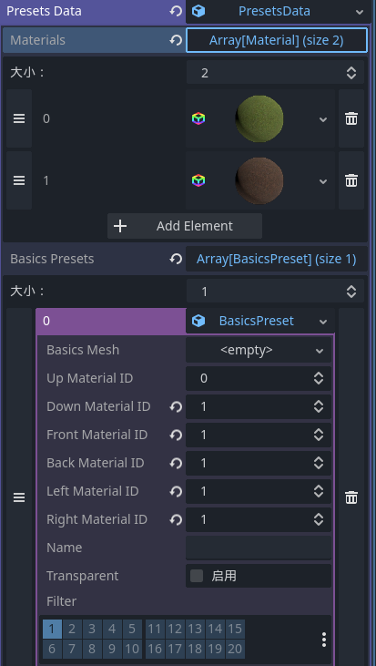
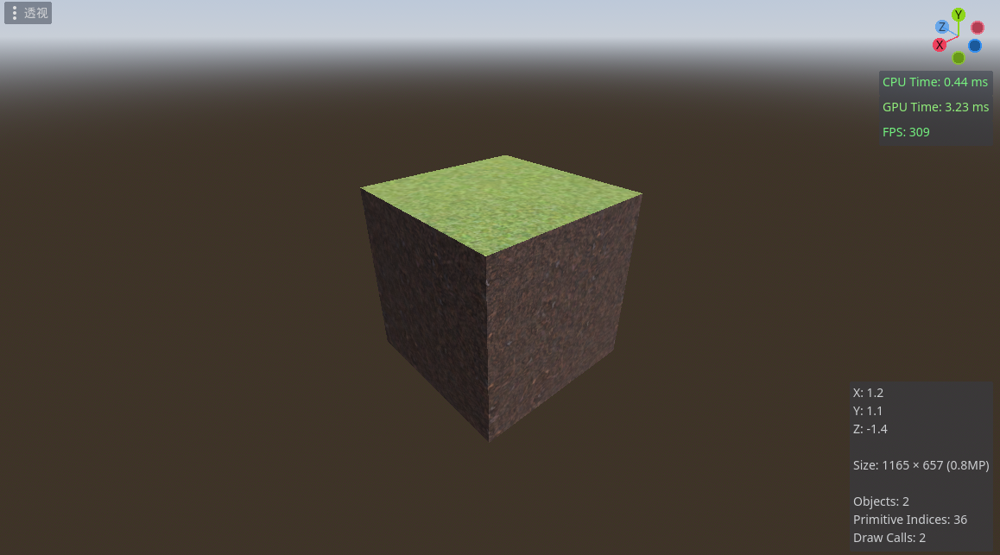

# VoxelExpansion
利用GDExpansion编写的高性能体素扩展，提供了相关的节点帮助用户生成自定义的体素世界而无需重新造轮子
# 如何配置？
我们可以在godot项目文件夹下新建一个文件夹并命名为`bin`，将编译好的动态链接库(*.dll)移动到`bin`文件夹内

然后在项目目录中新建一个文件并命名为`voxel.gdextension`
```
[configuration]
entry_symbol = "voxel_library_init"

[libraries]
windows.debug.x86_64 = "res://bin/voxel_expansion.windows.template_debug.dev.x86_64.dll"
windows.release.x86_64 = "res://bin/voxel_expansion.windows.template_release.dev.x86_64.dll"
```

打开Godot，我们使用快捷键`ctrl+A`打开创建节点窗口搜索`Voxel`


大功告成！我们可以看到自定义节点VoxelBlock和VoxelContainer

# 开始你的第一个体素世界
我们新建一个空场景，在里面添加一个`VoxelContainer`节点，我们在右侧的检查器里创建一个PresetsData


| 属性名        | 说明             |
| ------------- | ---------------- |
| Materials     | 材质列表         |
| BasicsPresets | 基础体素预设列表 |
| ModelPresets  | 静态网格预设列表 |
| DevicePresets | 3D结点预设列表     |

我们尝试添加2个材质预设、1个基本体素预设、一个网格预设用于我们的演示




嗯，太好了，我们现在为`VoxelContainer`设置好了`PresetsData`属性，这样`VoxelBlock`就知道我们需要绘制的网格应该是什么样子的

在设置中BasicsPresets[0]的预设描述的是一个顶部是草坪，而其他面是大理石的正方体

而ModelPresets[0]是一个类似帐篷的网格模型

***我们不建议为ModelPresets设置顶点数过多的网格，因为这样会拖慢构建网格的速度***

接下来我把`voxel_block_size`设置为`Vector3i(32,16,32)`

我们希望它可以生成网格，以便于我们观察，在编辑器内为`VoxelContainer`添加一个子节点`MeshInstance3D`用于绘制网格

---
现在来到编码阶段，我们在`VoxelContainer`节点里添加一个内置脚本
```
extends VoxelContainer

func _ready():
	var voxel_block_data : StandardVoxelBlockData = StandardVoxelBlockData.new()
	voxel_block_data.size = voxel_block_size
	
	for x in range(voxel_block_size.x):
		for z in range(voxel_block_size.z):
			var height = randi() % 2 + 2
			for y in range(height):
				voxel_block_data.set_voxel(Vector3i(x,y,z),voxel_block_data.basics_voxel(0,Vector3i(0,0,0)))
			if(randi() % 8 == 0):
				voxel_block_data.set_voxel(Vector3i(x,height,z),voxel_block_data.model_voxel(0,Vector3i(0,randi(),0)))
	set_voxel_block_data(Vector3i(0,0,0),voxel_block_data)
	
	$MeshInstance3D.mesh = voxel_block_data.generate_mesh()
```

嗯嗯嗯，现在我们按`F6`运行当前正在编辑的场景，额，怎么怎么也看不见？啊哦！忘记加摄像机节点了，再加上环境！嗯嗯嗯！看起来还不错！
a
ps:这草地贴图有点难看o(TヘTo)


